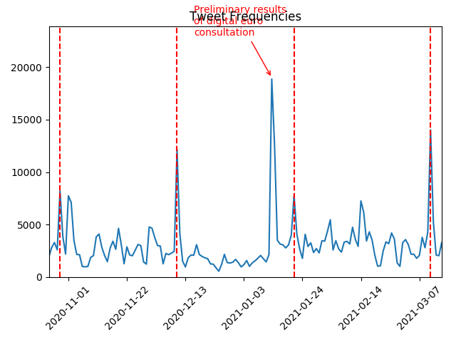

# Capstone Project: ETL Pipeline for streaming tweets

## Purpose

This Capstone project combines two data sets: A data set of tweets related to
the European Central Bank (ECB) streamed from the Twitter API and a data set of
events related to ECB monetary policy taken from the ECB's homepage.

To allow a combined analysis of the data, the project develops an ETL pipeline
in PySpark on AWS EMR. At first, it loads raw .json files containing tweets from an S3 input bucket.
The tweets are cleaned and transformed and then saved as a parquet on another
S3 output bucket.

Similarly, the events are also taken from an S3 bucket and saved as a parquet
on the S3 output bucket. This repository also contains the files which create
this data set of monetary policy events which can optionally be executed to
obtain the latest data.

This pipeline is the beginning for an advanced analysis of tweets using tools
from natural language processing and machine learning. Since the data is still
collected and will eventually grow big, the project is set up in AWS EMR
to ensure functionality once the data has grown very large.

## Intended Usage / Answers to reviewer scenarios:

Please look at "How to use this repository" below for a step by step guide.

The input data in the S3 input bucket will be updated every week with new tweets
copied automatically from an EC2 instance (the Twitter Stream is outside of this
project and not in this repository). The ETL pipeline in this repository can then
be run on demand to process the data and create analysis.

Since the pipeline is based on a Spark cluster using AWS EMR, the project can be
easily scaled up to bigger data, such as an 100% data increase (for example, by
adding more worker notes).

While the pipeline is triggered manually at the moment, there would be no issue
with adding scheduled triggers (for example, in Airflow).

With the output data of the ETL pipeline, it is possible for several
or even hundred users to access and use the parquet files in the output bucket.
It is not assumed and not recommended that several users run the ETL pipeline
since this would overwrite previous files in the output bucket. 

## Data

There are two main data sources:

1) An S3 bucket containing raw json files with tweets related to the ECB
obtained from the Twitter API

2) An S3 bucket containing monetary policy events. Those monetary policy events
comprise the ECB monetary policy decisions (taken from the ECB homepage) and
the speeches of ECB policymakers (taken from a data set provided by the ECB).

The ETL pipeline creates three spark dataframes Tweets, Users and Events (not strictly
in STAR format but useful for the later applications). The later applications
which are possible with this data format center around the following topics:
- Analysis of tweets (for example, sentiment analysis): A data frame of tweets
is readily available in parquet including basic metadata.
- Analysis of users (who is tweeting, what is the background of the users,
  how informed are they (as proxied by user description, verified account,
  or number of followers who trust this user)
- Combination of tweet activity with events (as shown below in the simple timeline
  of tweets with event activity)

## Overview of files

- capstone_project.default.cfg

This file contains the template with the necessary AWS keys and bucket
information.

- create_monetary_event_database.py

This file downloads the ECB data set of speeches, combines it with the data set
of monetary policy decisions created below and uploads it to S3

- etl_pyspark.py

This file runs the ETL pipeline to transform the raw data from tweets and events.
It puts the data as parquet files into an S3 output bucket.

- read_monetary_policy_decisions.py

This file reads the dates of all ECB monetary policy decisions from its homepage.

- timeline_pyspark.py

This file creates the timeline of the daily number of English tweets to create
the file tweet_time_series.png

- tweet_time_series.png

The timeline of the daily number of English tweets.

- wordcount.txt

The 200 hundred most often used English words and how often they have been used.

- wordcount_pyspark.py

This file creates the wordcount of the 200 hundred most often used English words.

- run_data_quality_checks.py

This file reads in the output parquet files as Spark data frames and tests
whether they contain all the necessary columns, i.e. whether they have been
correctly read in by the ETL pipeline.

## Data dictionary

The ETL pipeline creates three spark dataframes Tweets, Users and Events with
the following associated variables,

Tweets:

- tweet_id
- tweet_created_at
- tweet_lang
- tweet_text
- tweet_extended_text
- quoted_status_text
- quoted_status_extended_text
- user_id
- retweeted_user_id
- quoted_user_id

User:

- user_id
- user_created_at
- user_screen_name
- user_verified
- user_description
- user_followers_count
- user_friends_count (i.e. this twitter user is following # users on Twitter ("friends"))

Events:

- date
- type
- speakers

## How to use this repository

1. Add AWS access keys and secrets as well as the bucket information and e-mail to
the .cfg file
2. (Optional) Run read_monetary_policy_decisions.py locally to scrape dates for the monetary policy
decision dates from the ecb website
3. (Optional) Run create_monetary_event database which creates a data set from the monetary policy decision dates and speeches from ecb council members
4. Create EMR cluster on it, copy etl_pyspark.py and the cfg. file onto the cluster
5. Run etl_pyspark.py on cluster. This creates the parquet files.
6. Run run_data_quality_checks to verify that the data has been correctly loaded and transformed.
7. (Optional) Run wordcount_pyspark.py or timeline_pyspark.py to create the intermediary output files.

## Basic analysis

After running the ETL pipeline and having created the data sets, some basic analysis is done to illustrate the data set and show the connection between events and tweets.
The file timeline_pyspark.py creates the following image:

The image above shows the number of English tweets obtained per day on the left axis. The vertical, dashed lines in red denote the monetary policy decisions of the
ECB. Clearly, on days with monetary policy decisions, the number of tweets is
higher than on other dates, showing that the decisions are communicated and discussed on Twitter. The maximum number of tweets, however, is on January 13th,
when the ECB released a press statement with the preliminary results of its public consultation about the introduction of a digital euro.

The file wordcount_pyspark.py ranks the top 200 words and how often they were used
in English tweets. Stopwords and punctuation have been removed. The results can be found
in the text file wordcount.txt.
