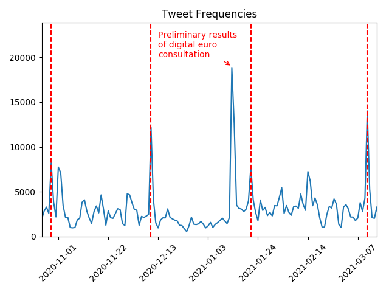

# Capstone Project: ETL Pipeline for streaming tweets

## Purpose

This Capstone project combines two data sets: A data set of tweets related to
the European Central Bank (ECB) streamed from the Twitter API and a data set of
events related to ECB monetary policy taken from the ECB's homepage.

To allow a combined analysis of the data, the project develops an ETL pipeline
which loads raw .json files containing tweets from an S3 input bucket.
The tweets are cleaned and transformed and then saved as a parquet on another
S3 output bucket.

Similarly, the events are also taken from an S3 bucket and saved as a parquet
on the S3 output bucket. This repository also contains the files which create
this data set of monetary policy events which can optionally be executed to
obtain the latest data.

## Data

There are two main data sources:

1) An S3 bucket containing raw json files with tweets related to the ECB
obtained from the Twitter API

2) An S3 bucket containing monetary policy events. Those monetary policy events
comprise the ECB monetary policy decisions (taken from the ECB homepage) and
the speeches of ECB policymakers (taken from a data set provided by the ECB).

## Overview of files

## How to use this repository

1. Add AWS access keys and secrets as well as the bucket information and e-mail to
the .cfg file
2. Run read_monetary_policy_decisions.py locally to scrape dates for the monetary policy
decision dates from the ecb website
3. Run create_monetary_event database which creates a data set from the monetary policy decision dates and speeches from ecb council members
4. Create EMR cluster on it, copy etl_pyspark.py and the cfg. file onto the cluster
5. Run etl_pyspark.py on cluster

## Basic analysis

